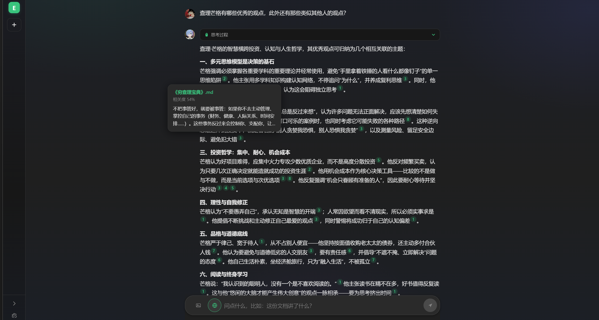
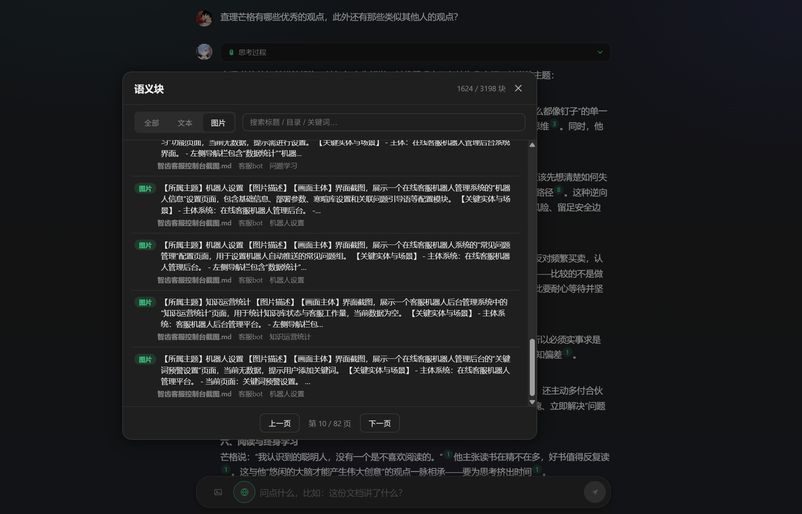
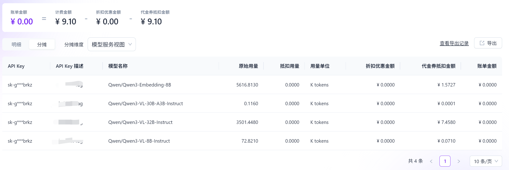
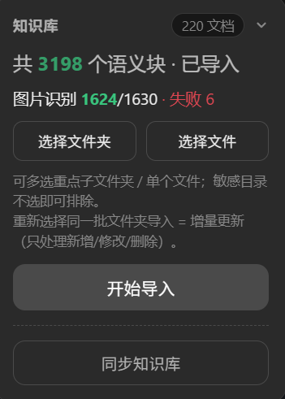

# Everything RAG — 个人知识第二大脑

**纯本地的 RAG（Retrieval-Augmented Generation）检索问答**：把「本地 Markdown 文档 + 各 AI 平台对话记录」统一向量化，用自然语言检索，**答案永远带来源，数据不出本机**。


设计初衷是打造 RAG Agent， 支持 MCP, Skills, Web_Search 等常见功能，并对分块与召回有不错的效果，目前在一步步实现中 


## 功能特性

- **本地知识库管理**：导入本地 Markdown 目录/多级子目录，一键向量化，答案带来源引用。
- **增量同步**：通过指纹比对（mtime+size 快路径 + 内容哈希确认）区分 新增/更新/删除/未变，在未来修改源信息只需做增量同步，而不是全部重新分块导入。
- **视觉理解（图文入库）**：文档里的图片(图床/本地图片)自动「下载 → 预处理 → 识图 → 文字描述 → 文本嵌入」，同图跨文档去重。
- **面向 Markdown 的切块优化**：针对语雀/Obsidian 导出文档的常见问题专门打磨
- **混合检索 + 精准召回**：dense 向量 + BM25 词法（标题注入）+ RRF 融合 + 多级相关度门禁
- **联网搜索**：使用 Tailvy api 问答时可按需联网搜索
- **API配置灵活性**： 对话模型，嵌入模型，视图模型，联网搜索均可自定义配置

## 分块与检索优势

### Markdown 切块（针对不规范源文档）

| 手段 | 解决的问题 |
|---|---|
| 标题层级切块 + 短段合并 | 空行/截断导致的孤立碎句；步骤式文档跨图合并 |
| 表格语义化（表头→`字段：值`，rowspan 继承）| 合并单元格表格平铺成噪声 |
| `plain`/`text` 伪代码围栏按正文处理、缩进不加粗 | 语雀导出把正文误判成代码 |
| 数值噪声过滤（数字+标点占比过高，如定价/统计表）| dense 检索噪声磁铁 |
| 语义切块（相邻段 embedding 相似度骤降处切分）| 一标题塞多个话题的边界漂移 |
| 图文融合块（图片描述 + 同节正文上下文）| 图片块信息密度低、不可被主题词命中 |

### 检索召回

- **混合检索**：dense（Qwen3-Embedding-8B 云端嵌入）+ BM25 词法（bigram + 文件名/标题注入）+ RRF 融合。
- **多级相关度门禁**：基础门禁 0.60 + 词法救援 0.45（短缩写/标题命中）+ 纯 dense 加罚（无词法匹配的假阳性）+ 数值噪声加罚。
- **父子检索**：命中块展开到「同父节（上级标题）」上下文，替代整篇文档拖入。
- **实测精度**：自建评测集 **hit@5 = 16/16（100%）**。


##  实际效果







## 模型花费







api 费用账单如上所示，1630 张图片，使用 **Qwen/Qwen3-VL-32B-Instruct** 成本 7.46 元， 知识库约 **50 w** 字，chrunk 合计3198个，使用 **Qwen/Qwen3-Embedding-8B** 嵌入处理成本 1.5 元， 合计 9.1 元 人民币。 对话模型费用账单略


总之还是一个比较便宜的方案。


## 快速开始

### 1. 环境要求

| 依赖 | 版本 | 说明 |
|---|---|---|
| Python | 3.11+ | 后端 |
| Node | 18+ | 仅构建前端时需要 |

> 嵌入/识图均走云端 OpenAI 兼容 API，无需本地下载大模型。

### 2. 安装依赖

```bash
# 后端（Windows：backend\.venv\Scripts\python）
cd backend
python -m venv .venv
.venv/Scripts/pip install -e ".[dev]"

# 前端（可选，不构建也能启动——后端直接托管已有 dist/）
cd ../frontend
npm install
```

### 3. 配置模型（对话/嵌入必配，识图/搜索可选）

两种方式任选其一，推荐**设置页**（图形化，实时生效）：

- **方式 A（推荐）**：启动后在 Web 设置页填写「对话模型 / 嵌入模型 / 识图模型 / 联网搜索 / 系统提示词」
- **方式 B（环境变量）**：复制模板 `backend/.env.example` → `backend/.env`，填写下表变量。

| 变量 | 必填 | 说明 |
|---|---|---|
| `EVERYTHING_RAG_CHAT_BASE_URL` / `_MODEL` / `_API_KEY` | ✅ | 对话模型（OpenAI 兼容端点） |
| `EVERYTHING_RAG_EMBED_BASE_URL` / `_MODEL` / `_API_KEY` | ✅ | 嵌入模型（OpenAI 兼容 `/embeddings`） |
| `EVERYTHING_RAG_SEARCH_API_KEY` | ✳ | 联网搜索（Tavily，可选） |
| `EVERYTHING_RAG_DATA_DIR` | ✳ | 数据目录，默认 `~/.everything-rag` |

。

### 4. 启动

```bash
# 回到仓库根目录
backend/.venv/Scripts/python scripts/run.py              # 随机端口 + 自动开浏览器
backend/.venv/Scripts/python scripts/run.py --no-browser # 自动化/CI 用（只打印端口）

# 或双击 start.bat（Windows）
```

启动后：**设置页配好模型 → 导入 Markdown 目录 → 增量同步 → 开始问答**。

## 常用命令

```bash
# 命令行全量导入（与 UI 导入一致，含识图；图片描述后台补全）
backend/.venv/Scripts/python scripts/import_md.py --dir "<你的文档目录>"

# 后端测试（Windows）
cd backend && .venv/Scripts/python -m pytest

# 前端构建
cd frontend && npm run build

# E2E（Playwright，需先启动服务）
cd frontend && npx playwright test
```


## 未来功能

* mcp ，skills 支持
* 支持多来源
* 更准确的分块策略
* ........
